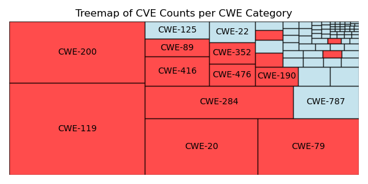
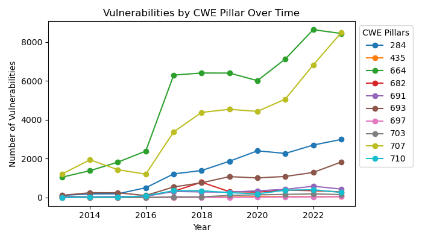
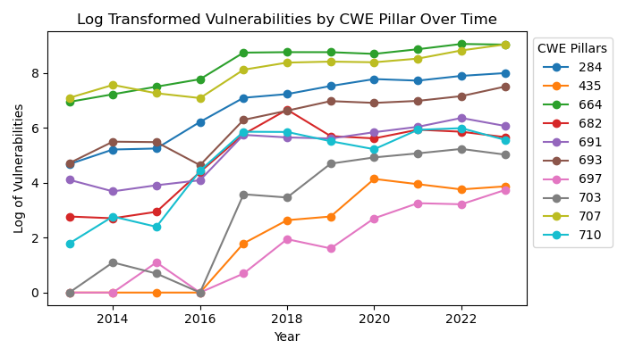
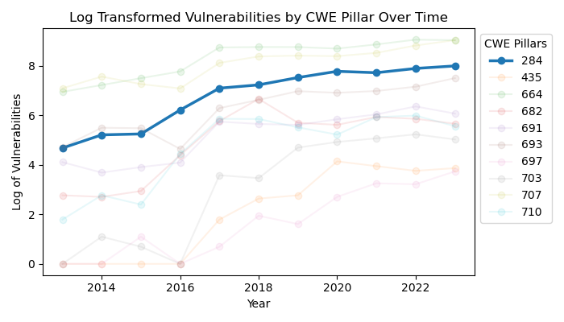
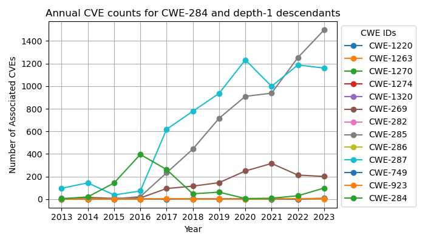
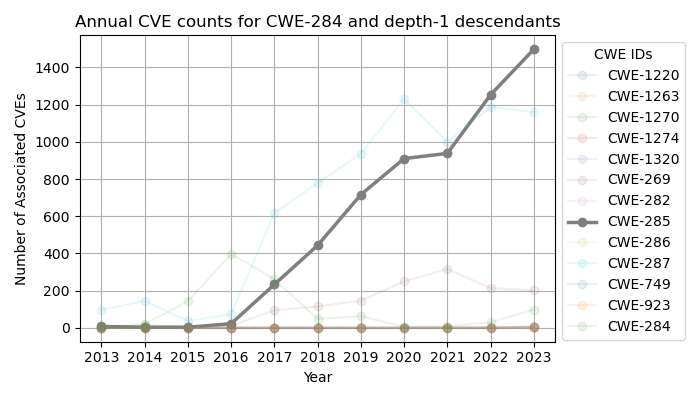

# Vulnerability Exploration Tool

The Vulnerability EXploration Tool (VEXT) is provided to promote the research in the vulnerability ecosystem.

## Quickstart

 - Download the latest release or `git clone git@github.com:vex-tool/vext.git`
 - `pip install -r requirements.txt`
 - `python3 bootstrap.py` 
 - start and interactive `ipython` session or explore examples in the notebooks folder with `jupyter-lab`

## Evaluate

The completeness of the dataset can be assessed by comparing the CWE classification of the dataset with the CWE classifications represented with the entire corpus of CVEs from the same time period.
For example, we used the tool to assess the completeness of the Secbench dataset compared to the most prevalent CWE categories of the year.

### Explore trends in weakness patterns
Starting with a high level overview of the weakness categories, this tool enables practitioners to explore vulnerability reports that are associated with different parts of the weakness taxonomy.

